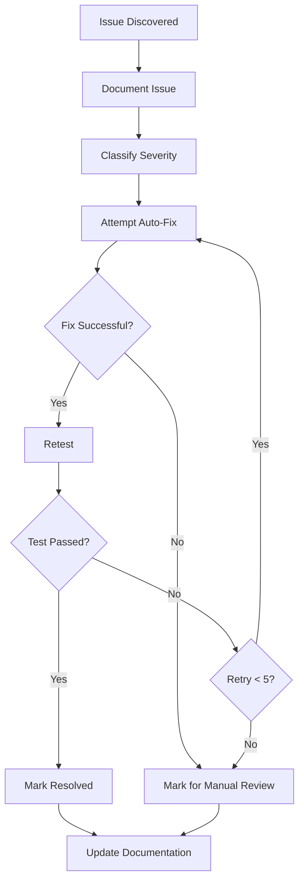

# Issue Documentation Guide

QA 테스트 중 발견한 이슈를 체계적으로 문서화하는 가이드라인.

## Issue Documentation Format

### Standard Issue Template

```markdown
# Issue Report: [간단한 제목]

## Metadata
- **Issue ID**: ISSUE-[timestamp]-[sequence]
- **Discovered**: [YYYY-MM-DD HH:mm:ss]
- **Page URL**: [테스트한 페이지 URL]
- **Severity**: [Critical | High | Medium | Low]
- **Status**: [Open | In Progress | Resolved | Cannot Reproduce]
- **Environment**: [Browser, OS, Viewport]

## Summary
[이슈에 대한 간단한 설명 (1-2 문장)]

## Steps to Reproduce
1. [첫 번째 단계]
2. [두 번째 단계]
3. [세 번째 단계]
...

## Expected Behavior
[예상되는 정상 동작]

## Actual Behavior
[실제로 발생한 문제]

## Screenshots / Videos


## Console Logs
```
[콘솔 에러 로그]
```

## Network Logs
```
[네트워크 요청/응답 로그]
```

## Additional Context
[추가 정보: 재현 빈도, 영향 범위 등]

## Potential Fix
[가능한 해결 방법 제안]

## Related Issues
- [관련 이슈 ID 또는 링크]
```

## Severity Classification

### Critical (심각)
**즉시 해결 필요** - 서비스 이용 불가 또는 데이터 손실 위험

#### 예시
- 로그인 완전 불가
- 결제 시스템 다운
- 데이터베이스 연결 실패
- 보안 취약점 (XSS, SQL Injection)

```markdown
**Severity**: Critical

**Impact**:
- 모든 사용자가 로그인할 수 없음
- 서비스 완전 중단
- 예상 영향 사용자: 100%

**Business Impact**:
- 매출 손실 발생
- 브랜드 이미지 타격
```

### High (높음)
**빠른 해결 필요** - 주요 기능 장애

#### 예시
- 특정 브라우저에서 로그인 실패
- 회원가입 폼 제출 실패
- 주요 페이지 404 에러
- 성능 심각 저하 (10초 이상 로딩)

```markdown
**Severity**: High

**Impact**:
- Safari 브라우저 사용자 로그인 불가
- 예상 영향 사용자: ~15%

**Workaround**:
- Chrome/Firefox 사용 권장
```

### Medium (중간)
**계획된 해결** - 부분적 기능 문제

#### 예시
- 검색 필터 일부 작동 안 함
- UI 레이아웃 깨짐 (일부 해상도)
- 에러 메시지 표시 누락
- 느린 페이지 로딩 (3-5초)

```markdown
**Severity**: Medium

**Impact**:
- 일부 검색 필터 사용 불가
- 사용자는 대체 방법으로 검색 가능
```

### Low (낮음)
**개선 사항** - 사소한 버그 또는 UX 개선

#### 예시
- 오타, 맞춤법 오류
- 아이콘 정렬 약간 틀어짐
- 툴팁 표시 위치 부자연스러움
- 색상 대비 미미한 차이

```markdown
**Severity**: Low

**Impact**:
- 사용자 경험에 미미한 영향
- 기능적 문제 없음
```

## Issue Status Definitions

### Open
- 이슈 발견, 아직 해결 시도 안 함
- 재현 가능성 확인됨

### In Progress
- 이슈 해결 시도 중
- 수정 코드 작성/테스트 중

### Resolved
- 이슈 해결 완료
- 재테스트 통과

### Cannot Reproduce
- 재현 불가능
- 일시적 문제였거나 환경 특수성

### Duplicate
- 이미 보고된 이슈와 중복
- 원본 이슈 ID 참조

## Detailed Documentation Examples

### Example 1: Login Form Validation Issue

```markdown
# Issue Report: Login Form Accepts Invalid Email Format

## Metadata
- **Issue ID**: ISSUE-20250128-001
- **Discovered**: 2025-01-28 14:32:15
- **Page URL**: https://example.com/login
- **Severity**: Medium
- **Status**: Open
- **Environment**: Chrome 121.0, macOS 14.2, Desktop (1920x1080)

## Summary
로그인 폼이 잘못된 이메일 형식을 허용하고 서버에 요청을 보냄. 클라이언트 측 검증 누락.

## Steps to Reproduce
1. https://example.com/login 접속
2. Email 필드에 "invalid-email" 입력
3. Password 필드에 "password123" 입력
4. "Login" 버튼 클릭

## Expected Behavior
- 클라이언트 측에서 이메일 형식 검증
- "Invalid email format" 에러 메시지 표시
- 서버 요청 보내지 않음

## Actual Behavior
- 검증 없이 서버에 요청 전송
- 서버에서 400 에러 반환
- 사용자에게 불명확한 에러 메시지 표시

## Screenshots


## Console Logs
```
POST https://example.com/api/login 400 (Bad Request)
Error: Invalid email format
    at handleLoginError (auth.js:42)
```

## Network Logs
```
Request:
POST /api/login
{
  "email": "invalid-email",
  "password": "password123"
}

Response: 400
{
  "error": "Invalid email format"
}
```

## Additional Context
- 모든 브라우저에서 재현됨
- 회원가입 폼은 정상적으로 이메일 검증 작동

## Potential Fix
```typescript
// Email validation 추가
const validateEmail = (email: string) => {
  const emailRegex = /^[^\s@]+@[^\s@]+\.[^\s@]+$/;
  return emailRegex.test(email);
};

// 폼 제출 전 검증
const handleSubmit = (e: FormEvent) => {
  e.preventDefault();

  if (!validateEmail(email)) {
    setError('Please enter a valid email address');
    return;
  }

  // 서버 요청...
};
```

## Related Issues
- ISSUE-20250120-005 (회원가입 폼 검증 참고)
```

### Example 2: Performance Issue

```markdown
# Issue Report: Homepage Loading Time Exceeds 10 Seconds

## Metadata
- **Issue ID**: ISSUE-20250128-002
- **Discovered**: 2025-01-28 15:45:22
- **Page URL**: https://example.com/
- **Severity**: High
- **Status**: In Progress
- **Environment**: Chrome 121.0, Windows 11, Desktop (1920x1080)

## Summary
홈페이지 초기 로딩 시간이 10초 이상 소요됨. 사용자 경험 심각하게 저하.

## Steps to Reproduce
1. https://example.com/ 접속
2. 페이지 로딩 시간 측정
3. DevTools Performance 탭 확인

## Expected Behavior
- 페이지 로딩 3초 이내 완료
- 주요 컨텐츠 1초 이내 표시 (LCP)

## Actual Behavior
- 전체 로딩 시간: 12.4초
- LCP: 8.2초
- FID: 450ms

## Screenshots


## Network Logs
```
Total Resources: 156
Total Size: 8.4 MB
- JS: 3.2 MB (12 files)
- CSS: 1.1 MB (8 files)
- Images: 4.1 MB (45 files)

Slowest Resources:
1. hero-image.jpg - 2.4 MB - 3.2s
2. bundle.js - 1.8 MB - 2.1s
3. styles.css - 890 KB - 1.4s
```

## Additional Context
- 느린 3G 연결에서 테스트 시 20초 이상 소요
- 홈페이지 방문자 이탈률 증가 예상
- 경쟁사 대비 2-3배 느림

## Potential Fix
1. **이미지 최적화**
   - WebP 포맷 사용
   - Lazy loading 적용
   - 적절한 사이즈로 리사이징

2. **코드 스플리팅**
   - Dynamic imports 사용
   - 초기 번들 사이즈 축소

3. **CSS 최적화**
   - Critical CSS 인라인 처리
   - 사용하지 않는 CSS 제거

4. **CDN 활용**
   - 정적 리소스 CDN 서빙

## Related Issues
- ISSUE-20250115-012 (이미지 최적화 제안)
```

### Example 3: Accessibility Issue

```markdown
# Issue Report: Form Inputs Missing Labels for Screen Readers

## Metadata
- **Issue ID**: ISSUE-20250128-003
- **Discovered**: 2025-01-28 16:20:45
- **Page URL**: https://example.com/contact
- **Severity**: Medium
- **Status**: Open
- **Environment**: Chrome 121.0 + NVDA, Windows 11

## Summary
연락 폼의 input 요소들이 적절한 label 또는 aria-label이 없어 스크린 리더 사용자가 필드를 구분할 수 없음.

## Steps to Reproduce
1. 스크린 리더 (NVDA) 실행
2. https://example.com/contact 접속
3. Tab 키로 폼 필드 이동
4. 스크린 리더가 읽는 내용 확인

## Expected Behavior
- 각 input 필드에 명확한 레이블 존재
- 스크린 리더가 "Name input", "Email input" 등으로 읽음
- ARIA 속성으로 필수 필드 표시

## Actual Behavior
- 스크린 리더가 "Edit text" 또는 "Unlabeled" 로만 읽음
- 어떤 필드인지 알 수 없음
- 필수 필드 정보 누락

## Screenshots


## Code Analysis
```html
<!-- ❌ 현재 코드 -->
<div class="form-group">
  <input type="text" name="name" placeholder="Your Name" />
</div>
<div class="form-group">
  <input type="email" name="email" placeholder="Your Email" />
</div>

<!-- ✅ 수정 필요 -->
<div class="form-group">
  <label for="name">Name *</label>
  <input
    type="text"
    id="name"
    name="name"
    placeholder="Your Name"
    aria-required="true"
  />
</div>
<div class="form-group">
  <label for="email">Email *</label>
  <input
    type="email"
    id="email"
    name="email"
    placeholder="Your Email"
    aria-required="true"
  />
</div>
```

## Additional Context
- WCAG 2.1 Level AA 위반
- 전체 사용자의 약 5-10%가 접근성 기능 사용
- 법적 준수 요구사항

## Potential Fix
1. 모든 input에 연결된 label 추가
2. aria-required, aria-invalid 속성 사용
3. 에러 메시지에 aria-live 적용
4. 키보드만으로 폼 완전 제어 가능하도록

## Related Issues
- ISSUE-20250110-008 (접근성 감사 결과 참고)
```

## JSON Format for Machine Processing

이슈를 구조화된 JSON 형식으로도 저장한다.

```json
{
  "issue_id": "ISSUE-20250128-001",
  "timestamp": "2025-01-28T14:32:15Z",
  "page_url": "https://example.com/login",
  "title": "Login Form Accepts Invalid Email Format",
  "severity": "medium",
  "status": "open",
  "environment": {
    "browser": "Chrome 121.0",
    "os": "macOS 14.2",
    "viewport": "1920x1080"
  },
  "reproduction_steps": [
    "Navigate to https://example.com/login",
    "Enter 'invalid-email' in Email field",
    "Enter 'password123' in Password field",
    "Click 'Login' button"
  ],
  "expected_behavior": "Client-side email validation should prevent invalid format",
  "actual_behavior": "Invalid email sent to server, unclear error message shown",
  "screenshots": ["./screenshots/issue-001-login-form.png"],
  "console_logs": [
    "POST https://example.com/api/login 400 (Bad Request)",
    "Error: Invalid email format at handleLoginError (auth.js:42)"
  ],
  "network_logs": {
    "request": {
      "method": "POST",
      "url": "/api/login",
      "body": {
        "email": "invalid-email",
        "password": "password123"
      }
    },
    "response": {
      "status": 400,
      "body": {
        "error": "Invalid email format"
      }
    }
  },
  "potential_fix": "Add email validation before form submission",
  "related_issues": ["ISSUE-20250120-005"],
  "tags": ["validation", "forms", "ux"]
}
```

## Automated Issue Detection Patterns

### Pattern 1: Console Errors
```typescript
// 콘솔 에러 자동 캡처
page.on('console', msg => {
  if (msg.type() === 'error') {
    captureIssue({
      type: 'console_error',
      message: msg.text(),
      severity: 'high'
    });
  }
});
```

### Pattern 2: Network Failures
```typescript
// API 실패 자동 감지
page.on('response', response => {
  if (response.status() >= 400) {
    captureIssue({
      type: 'api_error',
      url: response.url(),
      status: response.status(),
      severity: response.status() >= 500 ? 'critical' : 'high'
    });
  }
});
```

### Pattern 3: Performance Issues
```typescript
// 느린 로딩 자동 감지
const metrics = await page.metrics();
if (metrics.TaskDuration > 3000) {
  captureIssue({
    type: 'performance',
    metric: 'page_load',
    value: metrics.TaskDuration,
    severity: 'medium'
  });
}
```

## Issue Resolution Workflow



## Best Practices

### DO
✅ 명확하고 재현 가능한 단계 작성
✅ 스크린샷과 로그 첨부
✅ 심각도 정확히 분류
✅ 잠재적 해결 방법 제시
✅ 비즈니스 영향 명시

### DON'T
❌ 모호한 설명 ("잘 안 됨", "이상함")
❌ 재현 단계 생략
❌ 스크린샷 없이 UI 이슈 보고
❌ 심각도 과장 또는 축소
❌ 근본 원인 분석 없이 증상만 기록

## Integration with Learning System

발견된 이슈는 학습 데이터로 활용된다:

1. **패턴 인식**: 반복되는 이슈 유형 파악
2. **자동 감지**: 유사 이슈 조기 발견
3. **우선순위**: 과거 데이터 기반 중요도 판단
4. **예방**: 알려진 이슈 사전 체크

```typescript
// 학습 데이터 구조
interface IssueLearningData {
  issue_id: string;
  patterns: string[];
  auto_fix_success: boolean;
  resolution_time: number;
  recurrence_count: number;
  related_pages: string[];
}
```

이 가이드를 따라 모든 이슈를 체계적으로 문서화하고 효율적으로 해결한다.
